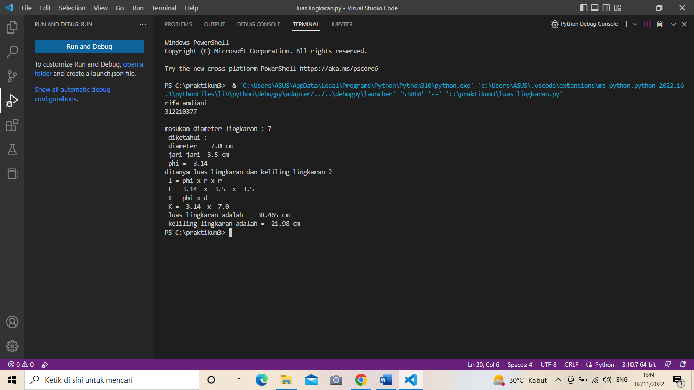
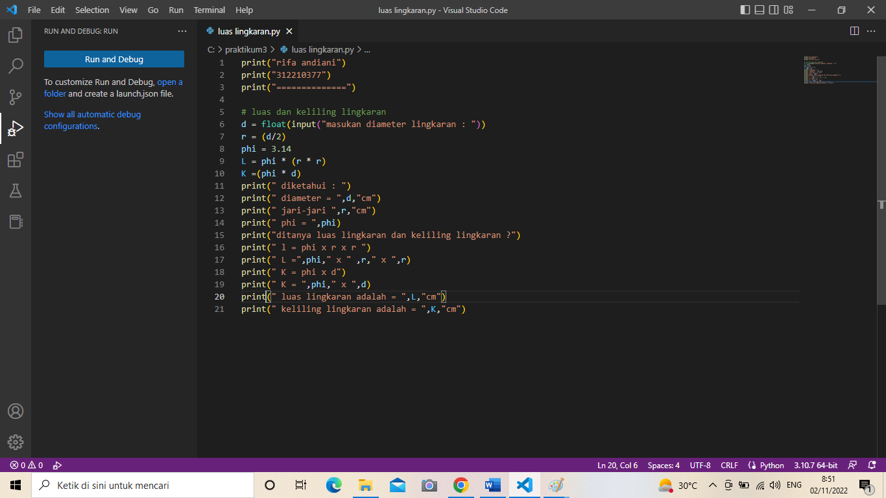
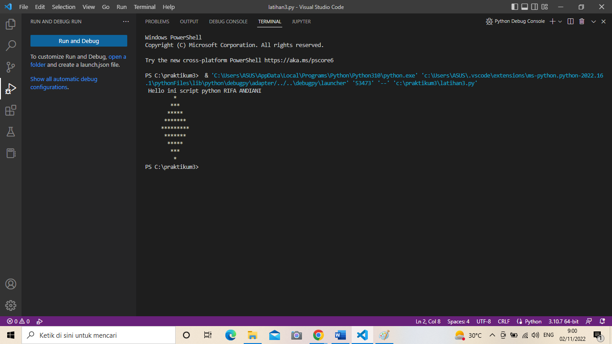
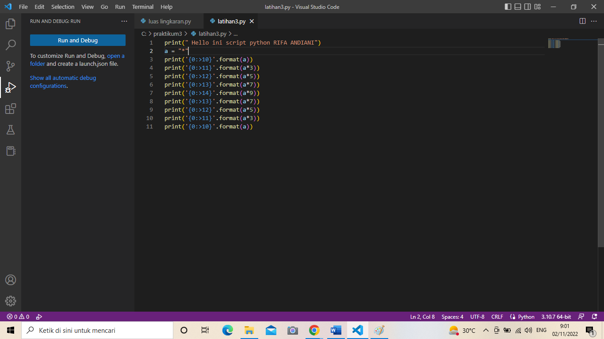

#praktikum3
# *latihan 1*
# 1. Parameter end
Parameter end berfungsi untuk mengganti karakter terakhir bawaan yang dicetak di layar. Jadi secara bawaan, setiap kali kita memanggil fungsi print() untuk mencetak sesuatu, python akan mencetak karakter ganti baris ( ) di setiap output.

contoh ada pada gambar dibawah ini:
# 2. Separator
sep adalah pemisah(separator) yang berfungsi sebagai tanda pemisah antar objek yang dicetak. Defaultnya adalah tanda spasi.
contoh ada pada gambar dibawah ini:

# 3. String format
Fungsi format() berfungsi untuk melakukan pengaturan format string yang akan dicetak atau ditampilkan ke monitor.
contoh ada pada gambar dibawah ini:

# *latihan 2*
# input dan output variabel a dan b 
membuat variabel a dan b dan mengisikan variabel tersebut value type class string, lalu menggabungkan, menambahkan dan membagikannya menggunakan string formating 
1. membuat variabel a,b dan input value variabel a, b
2. format hasil penggabungan 
3. format hasil penjumlahan 
4. format hasil pembagian
contoh kode programnya sebagai berikut: